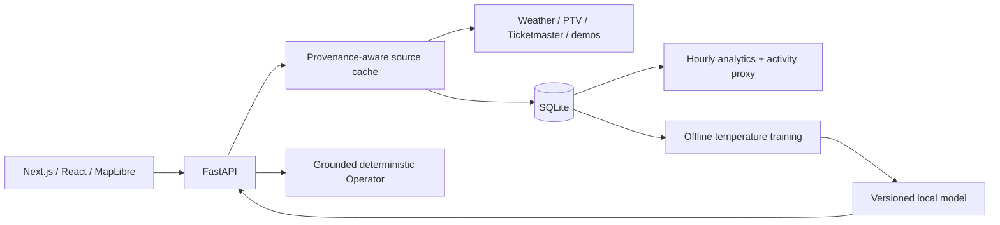
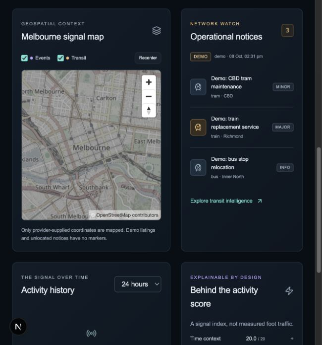

# CITYHQ · Melbourne

**City signals. Explainable analytics. Evidence before inference.**

CITYHQ is a local-first urban intelligence platform that brings Melbourne weather, service notices and event listings into one operational workspace. It demonstrates full-stack engineering, data provenance, time-series persistence and reproducible ML while making the boundary between real observations, demo fixtures and predictions explicit.

## What is implemented

- Six responsive views: Overview, Transit Intelligence, Weather Intelligence, Event Intelligence, Forecasting Lab and System Diagnostics.
- FastAPI adapters for wttr.in/OpenWeather, PTV and Ticketmaster; clearly labelled offline demos.
- SQLite historical observations, Alembic migrations, hourly aggregates, retention and CSV export.
- Explainable activity heuristic with component contributions, missing-input coverage and freshness.
- Reproducible next-hour temperature experiment: persistence baseline, Ridge and random forest; chronological evaluation and persisted inference.
- CITYHQ Operator: deterministic, grounded questions about internal signals with references and navigation. No paid LLM required.
- Interactive MapLibre Melbourne map with layer controls and provider-coordinate markers; no fabricated locations.
- Typed polling with cancellation, visibility awareness, bounded retries and honest error states.
- Backend/component/browser tests, CI, Dockerfiles and a persistent-volume Compose configuration.

This is an urban **signal** platform. Notice counts are not passenger congestion; event listings do not establish crowd size. The activity index is a heuristic, not a trained prediction or measured foot traffic.

## Run locally

Requires Python 3.11+, Node 24+, npm. Use the repository root in the first terminal:

```sh
python3 -m venv backend/venv
backend/venv/bin/pip install -r backend/requirements.txt
cp backend/.env.example backend/.env  # only if you do not already have one
cd backend
venv/bin/alembic upgrade head
venv/bin/python -m app.ml.pipeline --mode synthetic
venv/bin/uvicorn app.main:app --host 127.0.0.1 --port 8000
```

In a second terminal:

```sh
cd frontend
npm ci
cp .env.example .env.local  # only if absent
npm run dev
```

Open [CITYHQ](http://localhost:3000), [API reference](http://127.0.0.1:8000/docs) and [health](http://127.0.0.1:8000/health).

For a deterministic, credential-free demo, set `WEATHER_ADAPTER=demo` in the backend environment. Transport and events default to demo already. Default weather is `wttr` to retain the existing weather integration. If ports are occupied, use `--port 8105` for uvicorn and `npm run dev -- --port 3105`, set `NEXT_PUBLIC_API_URL=http://127.0.0.1:8105`, and add `http://localhost:3105,http://127.0.0.1:3105` to `CORS_ORIGINS`.

## Data status and credentials

| Source | Default | Enable real provider |
|---|---|---|
| Weather | wttr.in live attempt; unavailable on failure | No key for wttr; `WEATHER_ADAPTER=openweather` + `OPENWEATHER_API_KEY` for alternative |
| Transit | Explicit fictional demo notices | `TRANSPORT_ADAPTER=ptv`, `PTV_DEVID`, `PTV_API_KEY` |
| Events | Explicit fictional demo listings | `EVENTS_ADAPTER=ticketmaster`, `TICKETMASTER_API_KEY` |
| ML | Synthetic research experiment after training | Accumulate live weather, then train with `--mode observed` |

Provider credentials stay server-side. No live fallback is fabricated. A failed refresh retains previously successful data with stale metadata. Provider interfaces are covered by deterministic fixtures; real credentialed PTV/Ticketmaster access still requires verification with your account.

## Analytics and ML

Activity score weights: event listings 40, service notices 25, weather suitability 15, time context 20. Missing/stale components are omitted without rescaling. Coverage describes available inputs, not statistical confidence. Full [methodology and sensitivity](docs/DATA_AND_SCORING.md).

The executed synthetic experiment uses 180 days of hourly generated temperature with causal lags and a 60/20/20 chronological split. Test results:

| Model | MAE °C | RMSE °C |
|---|---:|---:|
| Persistence baseline | 1.178 | 1.405 |
| Ridge | 0.707 | 0.880 |
| Random forest (validation-selected) | 0.755 | 0.938 |

These are real results on **synthetic data**, not evidence of Melbourne forecast accuracy. Ridge happened to perform better on the held-out test; selection remains based on validation. [Reproduction and limitations](docs/ML_METHODOLOGY.md) · [Full evaluation artifact](docs/model-evaluation.json).

## Architecture



The existing Next.js/FastAPI architecture is retained. See [system design and trade-offs](docs/ARCHITECTURE.md), [API contracts](docs/API.md), [development journal](docs/PROGRESS.md) and [delivery validation](docs/DELIVERY.md).

## Tests and builds

```sh
cd backend
venv/bin/ruff check app tests migrations
venv/bin/ruff format --check app tests migrations
venv/bin/pytest -q
cd ../frontend
npm run lint
npm run typecheck
npm run format:check
npm test
npm run build
npx playwright install chromium
npm run test:e2e
```

E2E tests launch isolated demo servers on 3105/8105; no reuse of unrelated running applications. They intercept public map tiles to avoid automated load on OSM. The production build uses webpack because Turbopack process binding was restricted in the implementation environment.

## Containers and deployment review

```sh
docker compose up --build
# Train a demo artifact in the persistent volume:
docker compose exec backend python -m app.ml.pipeline --mode synthetic
```

Compose defaults to all-demo mode. The named volume persists the database and model; image builds do not embed `.env`, local datasets or models. Frontend public configuration is set at build time. Containers use non-root users; backend health checks storage; one backend worker is required for the local cache/scheduler design.

No cloud services have been provisioned and no deployment has been made. Before public deployment: configure HTTPS and exact CORS origins, durable storage/backups, authentication/rate limits, a permitted tile provider for expected traffic, secrets and live-provider contract verification. Free-tier disk persistence and limits vary; no hosting provider is assumed free or recommended without a fresh review. [Deployment notes](docs/DEPLOYMENT.md).

## Screenshots

Run in explicitly selected demo/live mode, open all six views, and capture a 1440×1000 desktop and 390×844 mobile viewport. Keep provenance badges and attribution visible. For a compelling demo, train the synthetic model first; show the sparse historical empty state honestly. Do not present fixture screenshots as live Melbourne activity.

## Known limitations and roadmap

- Live histories start empty; keep ingestion running to accumulate hourly observations. No fabricated historical trends.
- Synthetic forecasts continue the historical research timeline; 3/6-hour recursive horizons are not evaluated.
- Demo entries have no exact locations. PTV notices without coordinates are listed but not mapped.
- Ticketmaster coverage is limited to the first 100 upcoming listings over seven days; unknown attendance and impact.
- Single-process SQLite architecture; no authentication, distributed ingestion, calibrated intervals or LLM/voice integration.
- Next: verified live adapters, licensed historical weather import, expanding-window backtests, calibrated intervals, source-specific operational thresholds and a reviewed public deployment.

MIT licence. Provider data and map tiles remain subject to their own terms.

Verified local preview (real base map, demo transit notices):


