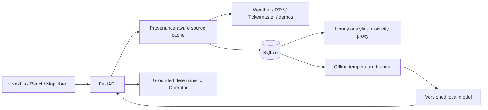
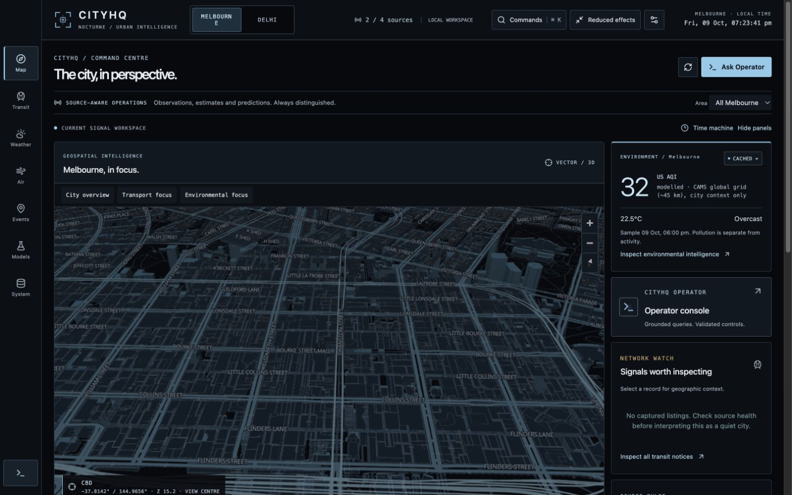

# CITYHQ · Melbourne / Delhi

**Two cities. Real public feeds. Honest provenance.**

[Nocturne delivery](docs/NOCTURNE_DELIVERY.md) · [Reality Engine delivery](docs/REALITY_ENGINE_DELIVERY.md) · [Overdrive delivery report](docs/OVERDRIVE_DELIVERY.md) · [Operator commands](docs/OPERATOR.md) · [Geographic sources](docs/GEOGRAPHY.md)

CITYHQ is a local-first urban intelligence platform that brings Melbourne and Delhi weather, modelled air quality, available transport information and event listings into one operational workspace. It demonstrates full-stack engineering, data provenance, time-series persistence and reproducible ML while making the boundary between real observations, demo fixtures and predictions explicit.

## What is implemented

- Original Nocturne instrument system: map-led layout, compact mobile navigation, source disclosures, discrete capture scrubber, optional bounded spatial transition and a restrained Operator console.
- Seven responsive views with a Melbourne / Delhi selector: Overview, Transit, Weather, Air Quality, Events, Forecasting and Diagnostics.
- Verified Open-Meteo weather and CAMS air-quality estimates for both cities. PTV HMAC and paginated Ticketmaster adapters with explicit credentials-required states. Legacy Melbourne weather adapters and selectable offline demos remain.
- Delhi Metro explorer with 245 OSM station nodes and 24 directional route relations; attributed static geometry, station search and route filtering. No live Metro delays are claimed.
- City-scoped SQLite observations, raw provider payloads, Alembic migrations, hourly aggregates, retention, historical replay and CSV export.
- Explainable activity heuristic with component contributions, missing-input coverage and freshness.
- Reproducible next-hour temperature experiment: persistence baseline, Ridge and random forest; chronological evaluation and persisted inference.
- CITYHQ Operator: deterministic, grounded internal queries plus validated camera, layer, navigation and time-range actions. Session transcript, supporting data, reset and real processing states. No paid LLM required.
- Map-first command centre: tilted MapLibre vector geography, dataset-supported 3D buildings, eleven verified camera presets across the two cities, selectable signals, layer controls and provider-coordinate markers.
- Stored-capture time machine, provenance-grouped period comparisons, gap-aware charts and a separate deterministic scenario lab.
- Skippable first-session briefing, keyboard command palette, collapsible instrumentation, reduced effects and responsive navigation.
- Typed polling with shared GET deduplication, independent subscriber cancellation, visibility awareness, bounded retries and honest error states.
- Backend/component/browser tests, CI, Dockerfiles and a persistent-volume Compose configuration.

This is an urban **signal** platform. Notice counts are not passenger congestion; event listings do not establish crowd size. The activity index is a heuristic, not a trained prediction or measured foot traffic.

## Run locally

Requires Python 3.11+, Node 24+, npm. Use the repository root in the first terminal:

```sh
python3 -m venv backend/venv
backend/venv/bin/pip install -r backend/requirements.txt
cp backend/.env.example backend/.env  # only if you do not already have one
cd backend
venv/bin/alembic upgrade head
venv/bin/python -m app.ml.pipeline --mode synthetic
venv/bin/uvicorn app.main:app --host 127.0.0.1 --port 8000
```

In a second terminal:

```sh
cd frontend
npm ci
cp .env.example .env.local  # only if absent
npm run dev
```

Open [CITYHQ](http://localhost:3000), [API reference](http://127.0.0.1:8000/docs) and [health](http://127.0.0.1:8000/health).

The running local preview uses [port 3105](http://127.0.0.1:3105) and [API 8105](http://127.0.0.1:8105/docs). For those ports, build/run the frontend with `NEXT_PUBLIC_API_URL=http://127.0.0.1:8105` and allow `http://127.0.0.1:3105` in backend CORS. Existing environment files are preserved; update old adapter selections explicitly if they still select demos.

## Data status and credentials

| Source                   | Default                                                         | Activation / limitations                                                                                                                       |
| ------------------------ | --------------------------------------------------------------- | ---------------------------------------------------------------------------------------------------------------------------------------------- |
| Weather, both cities     | `open-meteo`, verified modelled current conditions and forecast | Public noncommercial API, no key; CC BY attribution, no SLA                                                                                    |
| Air quality, both cities | `open-meteo-aq`, verified CAMS model estimates                  | PM2.5/PM10/NO₂/O₃; US and European AQI explicitly distinct from Indian AQI                                                                     |
| Melbourne transit        | `ptv`                                                           | `PTV_DEVID` + `PTV_API_KEY`; missing keys report `credentials_required`                                                                        |
| Delhi transit            | `delhi-metro-static`                                            | Bundled public OSM snapshot, ODbL; operational status unknown. Official DMRC download requires a terms/identity form and was not bypassed      |
| Events, both cities      | `ticketmaster`                                                  | `TICKETMASTER_API_KEY`; bounded pagination; zero listings differs from failure; Delhi coverage incomplete                                      |
| ML                       | Separate city artifacts                                         | `--city melbourne` or `--city delhi`; synthetic research labels retained; genuine observed backtesting currently reports insufficient coverage |

For a fully offline demo explicitly set `WEATHER_ADAPTER=demo AIR_QUALITY_ADAPTER=demo TRANSPORT_ADAPTER=demo EVENTS_ADAPTER=demo`. Delhi Metro may remain static; `DELHI_TRANSPORT_ADAPTER=demo` is also available. No provider failure silently selects a demo. Credentials stay server-side. Live means a recent real-provider fetch, not proof of a ground-station measurement; data kind is reported separately. Cached data has an age; stale data is excluded from activity scoring.

Provider documentation, licences, actual smoke evidence and account limitations are in the [source matrix](docs/REALITY_ENGINE_DELIVERY.md). Commercial Open-Meteo use needs an appropriate provider agreement; no paid resources were created.

## Analytics and ML

Melbourne weights: event listings 40, service notices 25, weather suitability 15, time context 20 (maximum 100). Delhi omits unmeasured service status (maximum 75) and uses a separate 26°C temperature suitability prior. AQI is reported separately and never increases activity. Different city score maxima and coverage prevent direct activity comparisons. Missing/stale components are omitted without rescaling. Coverage describes available inputs, not statistical confidence. Full [methodology and sensitivity](docs/DATA_AND_SCORING.md).

The executed synthetic experiment uses 180 days of hourly generated temperature with causal lags and a 60/20/20 chronological split. Test results:

| Model                               | MAE °C | RMSE °C |
| ----------------------------------- | -----: | ------: |
| Persistence baseline                |  1.178 |   1.405 |
| Ridge                               |  0.707 |   0.880 |
| Random forest (validation-selected) |  0.755 |   0.938 |

These are real results on **synthetic data**, not evidence of Melbourne forecast accuracy. The separate [Delhi synthetic evaluation](docs/model-evaluation-delhi.json) is also reproducible and does not establish Delhi accuracy. Ridge happened to perform better on the held-out test; selection remains based on validation. [Reproduction and limitations](docs/ML_METHODOLOGY.md) · [Full evaluation artifact](docs/model-evaluation.json).

## Architecture



The existing Next.js/FastAPI architecture is retained. See [system design and trade-offs](docs/ARCHITECTURE.md), [API contracts](docs/API.md), [development journal](docs/PROGRESS.md) and [delivery validation](docs/DELIVERY.md).

## Tests and builds

```sh
cd backend
venv/bin/ruff check app tests migrations
venv/bin/ruff format --check app tests migrations
venv/bin/pytest -q
cd ../frontend
npm run lint
npm run typecheck
npm run format:check
npm test
npm run build
npx playwright install chromium
npm run test:e2e
```

E2E tests launch isolated demo servers on 3115/8115 and use `.next-e2e` plus a temporary SQLite database; they do not reuse the production preview on 3105/8105. They intercept public map tiles with an explicitly synthetic empty style. Real vector geography was checked separately in the browser. The production build uses webpack because Turbopack process binding was restricted in the implementation environment.

## Containers and deployment review

```sh
docker compose up --build
# Train a demo artifact in the persistent volume:
docker compose exec backend python -m app.ml.pipeline --mode synthetic
```

Compose defaults to all-demo mode. The named volume persists the database and model; image builds do not embed `.env`, local datasets or models. Frontend public configuration is set at build time. Containers use non-root users; backend health checks storage; one backend worker is required for the local cache/scheduler design.

No cloud services have been provisioned and no deployment has been made. Before public deployment: configure HTTPS and exact CORS origins, durable storage/backups, authentication/rate limits, a permitted tile provider for expected traffic, secrets and live-provider contract verification. Free-tier disk persistence and limits vary; no hosting provider is assumed free or recommended without a fresh review. [Deployment notes](docs/DEPLOYMENT.md).

## Screenshots

The current Nocturne review covers both cities and all seven views at 1920×1080, 1440×900, 1024×768, 768×1024, 430×932, 390×844 and 320×568. Native browser captures use real geography and the configured public providers; deterministic acceptance screenshots use demo feeds and intercepted tiles. See the [Nocturne verification record](docs/NOCTURNE_DELIVERY.md). Earlier [Overdrive screenshots](docs/OVERDRIVE_DELIVERY.md) retain their historical provider context. Screenshots record a moment in time.



## Known limitations and roadmap

- Live histories start empty; keep ingestion running to accumulate hourly observations. No fabricated historical trends.
- Synthetic forecasts continue the historical research timeline; 3/6-hour recursive horizons are not evaluated.
- Demo entries have no exact locations. PTV notices without coordinates are listed but not mapped.
- Ticketmaster pagination is bounded at 1000 upcoming listings over seven days; coverage, attendance and impact remain unknown.
- Single-process SQLite architecture; no authentication, distributed ingestion, calibrated intervals or LLM/voice integration.
- Next: credentialed provider activation, licensed historical weather import, expanding-window backtests, calibrated intervals, source-specific operational thresholds and a reviewed public deployment.

MIT licence. Provider data and map tiles remain subject to their own terms.

The review preview uses [frontend port 3105](http://127.0.0.1:3105) and [API port 8105](http://127.0.0.1:8105/docs). See the delivery report for the exact commands; the default setup above still uses 3000/8000.

## Reality Engine commands

All city APIs accept `?city=melbourne|delhi`; omitted city retains Melbourne compatibility. `/api/v1/air-quality`, `/api/v1/metro?city=delhi`, `/api/v1/compare/air-quality` and `/api/v1/cities` are new. Operator accepts `{"question":"What is the AQI in Delhi?","city":"melbourne"}` and returns validated city/navigation actions.

```sh
cd backend
venv/bin/python -m app.ml.pipeline --city delhi --mode synthetic
venv/bin/python -m app.ml.pipeline --city delhi --mode observed --backtest
# Optional public network verification, kept out of CI:
PYTHONPATH=. venv/bin/python scripts/verify_providers.py --credentialed
# After editing app/cities.json, regenerate the small frontend registry:
venv/bin/python scripts/sync_city_registry.py
```

Backtesting excludes synthetic and modelled current weather; no real-world accuracy is claimed until sufficient genuine observed city history exists. Open-Meteo values remain useful model estimates in live and historical views.
