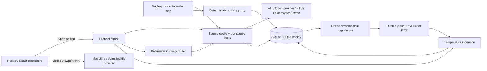

# System design

## Boundaries and contracts

The browser accesses CityHQ for all city signals. Only map tiles go directly to a map provider. Secrets stay in backend environment variables. Original `/weather`, `/transport`, `/events` paths remain compatible; the old service imports delegate to the new ingestion boundary. Wind is consistently km/h.

`app/config.py` loads backend-local environment configuration. `schemas.py` validates normalized signals. `adapters.py` handles provider formats. `ingestion.py` owns timeouts, retries, cache freshness and safe failures. `persistence.py` owns six tables. `analytics.py` computes the heuristic. `ml/` handles reproducible training and inference. `operator.py` maps questions to bounded internal queries. `api.py` exposes routes; `main.py` runs the ingestion lifespan and health checks.

## Storage and process model

Run one backend worker with SQLite. Cache locks and ingestion scheduling are process-local. Multiple workers would multiply external requests and can race on deduplication. For scale, move ingestion into a separate scheduled worker, use a shared cache and PostgreSQL, and add unique idempotency constraints.

Alembic owns schema creation. Startup fails if migrations are absent. UTC offset-bearing ISO timestamps sort chronologically. Separate weather, transport and event tables retain normalized payloads and provenance. Identical source payloads within an hour are deduplicated; one unchanged sample per subsequent hour supports honest sampling. Hourly activity rows use the latest sample within that hour, not an arithmetic mean. Missing or stale signals are null in history. Charts must not treat unavailable counts as zero.

Retention defaults to 90 days and is applied to all six tables. Make a SQLite backup before migration/retention changes. Use durable disk; ephemeral hosting loses history. Demo observations remain explicitly labelled and are excluded from observed ML training.

## Reliability

Each provider request has an 8-second timeout, at most three attempts for network errors/429/selected 5xx, exponential backoff, and a 26-second overall limit. Source-specific TTLs: weather 600s, transit 120s, events 1800s. Failed sources retry no sooner than 60s. Failed refreshes retain last successful data and timestamps with stale/error flags; no live-to-demo fallback occurs silently.

Frontend requests time out at 30s, abort on unmount, never overlap within a poller, back off on failures and pause new polls while hidden. Manual refresh re-queries CityHQ without bypassing server TTLs. The Melbourne clock is isolated from source timestamps. API errors override the sidebar status; /health describes API/storage readiness, not feed health.

The Operator is deliberately deterministic, with no shell, file or external-action tools. Forecast artifact loading accepts only the server-configured trusted path; never load untrusted joblib files. This local portfolio application has no authentication or rate-limiting gateway: add those before an internet-facing production release.

## Trade-offs

JSON payloads preserve provider flexibility while the indexed timestamps enable local histories. SQLite and one worker make zero-cost setup simple. Hash-based navigation provides shareable six-view state without duplicating polling lifecycles. The map is code-split; charts and animations disable unnecessary transitions. System fonts avoid remote font downloads during builds. Webpack mode avoids a sandbox-specific Turbopack process/port restriction.
