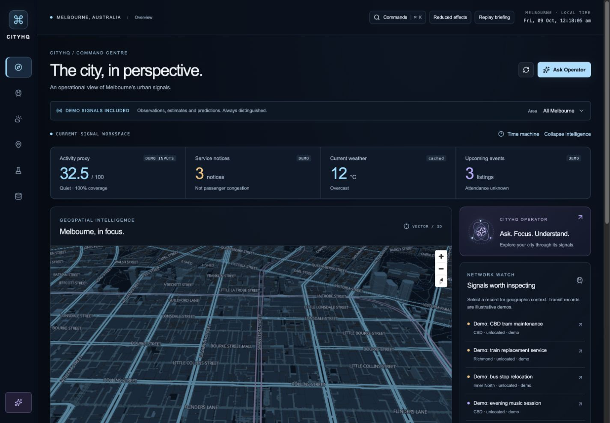

# CITYHQ Overdrive — delivery record

Verified locally on 2026-10-09, Australia/Melbourne. No push, cloud provisioning or deployment was performed. The earlier [delivery record](DELIVERY.md) describes the original foundation; this document describes the implemented Overdrive upgrade.

## 1. Executive summary

CITYHQ now centres its six-view application on a real tilted Melbourne vector map, contextual intelligence and a deterministic Operator that can control the interface. Historical capture replay, provenance-aware comparison, a non-causal scenario lab, research diagnostics, a command palette and an optional briefing are working features. Existing SQLite observations, provider adapters, forecasting pipeline, CSV export and container architecture were preserved.

This is a portfolio application verified on a local production build, with explicit demo/live/synthetic boundaries. It has not been certified for public operational use.

## 2. Visual verification

Real OpenFreeMap tiles, geographic labels and dataset-supported building extrusions were inspected in the production preview. All six views and the Operator were captured at CSS viewport widths 1920, 1440, 768 and 390. Screenshots below are browser captures, not generated mockups. Native captures can omit scrollbar pixels, so bitmap width is slightly smaller than the requested CSS viewport. Full-page captures include content beyond the initial viewport. Mobile/document geometry and the automated suite showed no horizontal page overflow.

| Workspace | 1920 | 1440 | 768 | 390 |
|---|---|---|---|---|
| Overview / map | [image](screenshots/overdrive-overview-1920.jpg) | [image](screenshots/overdrive-overview-1440.jpg) | [image](screenshots/overdrive-overview-768.jpg) | [image](screenshots/overdrive-overview-390.jpg) |
| Operator | [image](screenshots/overdrive-operator-1920.jpg) | [image](screenshots/overdrive-operator-1440.jpg) | [image](screenshots/overdrive-operator-768.jpg) | [image](screenshots/overdrive-operator-390.jpg) |
| Transit | [image](screenshots/overdrive-transit-1920.jpg) | [image](screenshots/overdrive-transit-1440.jpg) | [image](screenshots/overdrive-transit-768.jpg) | [image](screenshots/overdrive-transit-390.jpg) |
| Weather | [image](screenshots/overdrive-weather-1920.jpg) | [image](screenshots/overdrive-weather-1440.jpg) | [image](screenshots/overdrive-weather-768.jpg) | [image](screenshots/overdrive-weather-390.jpg) |
| Events / map | [image](screenshots/overdrive-events-1920.jpg) | [image](screenshots/overdrive-events-1440.jpg) | [image](screenshots/overdrive-events-768.jpg) | [image](screenshots/overdrive-events-390.jpg) |
| Forecasting | [image](screenshots/overdrive-forecast-1920.jpg) | [image](screenshots/overdrive-forecast-1440.jpg) | [image](screenshots/overdrive-forecast-768.jpg) | [image](screenshots/overdrive-forecast-390.jpg) |
| Diagnostics | [image](screenshots/overdrive-diagnostics-1920.jpg) | [image](screenshots/overdrive-diagnostics-1440.jpg) | [image](screenshots/overdrive-diagnostics-768.jpg) | [image](screenshots/overdrive-diagnostics-390.jpg) |

Additional verified workspaces: [stored timeline](screenshots/overdrive-timeline-1440.jpg), [scenario with matching client/server calculation](screenshots/overdrive-scenario-1440.jpg), [initial viewport](screenshots/overdrive-hero-1440.jpg). Weather changed during capture (13°C clear to 12°C overcast); these are actual retrievals at different times. Its observation timestamp was omitted by wttr and remains unknown. Transit and events are fictional demos throughout.



## 3. Implemented features and status matrix

| Feature | Status | Verification / boundary |
|---|---|---|
| Six responsive views and original visual system | Implemented and verified | Browser review, four widths, navigation/filter tests |
| Vector geography and dataset-supported 3D buildings | Implemented and verified | Actual public tiles inspected separately from test fixtures |
| Camera presets, pan/zoom, 2D, recenter, layers | Implemented and verified | Sourced catalogue, manual review and browser action tests |
| Provider-coordinate markers and selected context | Implemented and verified with fixtures | Fixture location/popup/layer test; no live event/transit coordinates available |
| Grounded Operator with typed dashboard actions | Implemented and verified | Backend validation plus browser execution and real production situation report |
| Historical capture replay / comparison / gaps | Implemented and verified | Actual SQLite captures and isolation/freshness tests; sparse coverage remains sparse |
| Scenario lab | Implemented and verified | Slider/reset/API tests, manual matching server result; no observation writes |
| Command palette, focus restoration, briefing | Implemented and verified | Native dialog/browser checks; briefing displays actual source states and is skippable |
| Reduced effects / responsive layout | Implemented and verified | Explicit mode and four-width browser suite; no full assistive-device certification |
| wttr weather | Implemented and externally verified | Real retrieval; current response has no dated observation time |
| PTV / Ticketmaster live adapters | Implemented but not externally verified | Normalization fixtures pass; credentialed account verification remains |
| Transit/event default sources | Demo mode | Explicit fictional records, unlocated where no supplied coordinate exists |
| Forecast evaluation and residuals | Verified synthetic research | Executed seed-42 pipeline; no real Melbourne accuracy claim |
| Observed-data ML training | Implemented but no qualifying real evaluation yet | Excludes demos/undated weather; requires sufficient complete dated history |
| Container deployment topology | Implemented; foundation containers previously verified | New production frontend build and patched backend tested locally; upgraded images not rebuilt in this pass |
| Public deployment/authentication/distributed limits | Planned prerequisites | No public deployment performed |
| Voice/LLM, calibrated intervals, regional heatmap | Not implemented / future work | No mandatory paid services or fabricated substitutes |

## 4. Operator capabilities

The deterministic router queries current city overview, weather, provider outlook, transport, events, activity, scoring explanations, stored comparison, research forecast and source health. Responses carry references, tool calls and supporting data. Examples: “Give me a situation report”, “Explain the activity score”, “Show Melbourne Park”, “Show transport disruptions”, “Compare last six hours”, “Show forecast” and “Hide events layer”.

The frontend executes only the four validated action types: navigate dashboard, focus a catalogue location, toggle a fixed layer and select an allowed range. Unknown fields/values are rejected on both sides. A bounded memory transcript, reset, sources, keyboard input and real processing/error states are included. No external language model, arbitrary code, microphone or persistent chat storage is involved. [Full command reference](OPERATOR.md).

## 5. Map capabilities

OpenFreeMap / OpenMapTiles / OpenStreetMap provide real vector geography. Seven sourced presets cover CBD, Flinders Street, Southern Cross, Melbourne Park, Docklands, Southbank and St Kilda. Desktop supports a tilted camera and source-height buildings; mobile/reduced effects flatten the experience. Events/transit/major transit alerts use supplied coordinates only. Weather is an area reading; optional named-area envelopes are approximate geographic extents. Selecting records shows details and related area signals without asserting causality.

Lazy loading, bounded pixel ratio/tile cache, efficient marker updates, ResizeObserver cleanup, explicit attribution, style/WebGL/tile errors and retry are implemented. No decorative substitute geography, invented regional intensity or administrative-boundary claim is used. [Sources and limitations](GEOGRAPHY.md).

## 6. ML and analytics improvements

The Forecasting Lab surfaces version, target, mode, seed, hash, sample count, split dates, horizon, measured comparisons, feature importance and limitations. Actual selected-model held-out errors now supply a 12-bin residual histogram, exact bin table and chronological error samples. No uncalibrated prediction interval is displayed.

The executed synthetic experiment has 4,295 complete feature rows (2,576 train / 858 validation / 859 test, two boundary purges). Random forest remains validation-selected: test MAE 0.755448°C, RMSE 0.938193°C. Persistence MAE 1.177857°C, RMSE 1.404925°C. Ridge MAE 0.706572°C, RMSE 0.880057°C; its better test performance is disclosed without post-test selection. [Evaluation artifact](model-evaluation.json) and [reproduction methodology](ML_METHODOLOGY.md).

History charts break across absent hours and changed provenance. Capture replay uses only data stored before the chosen timestamp, expires old sources and never falls back to live data. Period comparison groups provenance and reports coverage. Scenario controls adjust deterministic contributions without persistence. Activity proxy v1.1 preserves weights and fixes half-decimal rounding consistency; older v1.0 values can differ by 0.1 at those boundaries.

## 7. Architecture changes

The existing Next.js/React/TypeScript and FastAPI/SQLite architecture remains. New command-centre, map, Operator, research and workspace-control modules compose the surface. Shared typed GET requests deduplicate concurrent subscribers while respecting independent cancellation. Visibility-aware polling retains last-success data, scopes errors by query, aborts cleanup and prevents overlapping polls.

Backend additions are strict action/scenario schemas, timeline and comparison services, scenario validation and bounded Operator execution. External content stays data/plain text. The local process owns ingestion/cache/rate limits; it is deliberately single-worker. [Architecture](ARCHITECTURE.md) · [API](API.md).

## 8. Test results

| Check | Result |
|---|---|
| Backend pytest | 25 passed after dependency patches |
| Ruff / Python formatting / pip check | Passed |
| Frontend unit tests | 9 passed across 3 files |
| TypeScript / ESLint / Prettier | Passed |
| Production Next webpack build | Passed; standalone preview returns HTTP 200 |
| Playwright | 8 passed (final run ~1.1 minutes) |
| Overview axe WCAG A/AA automated scan | Zero violations in tested state |
| Production browser | Actual vector tiles, source provenance, scenario result, stored replay and grounded Operator verified |

The browser suite covers navigation, filtering, unavailable API state, forecast controls, session reset, provider-coordinate markers, map failure/retry, typed camera actions, replay, comparison, scenario reset, dialog focus restoration, reduced effects and all six views at four widths. Public tiles are intercepted with an empty synthetic style in automation to avoid repeated provider load; actual geography was manually inspected in the separate production preview. This is not a comprehensive accessibility, penetration or long-duration memory test. Upstream TestClient/httpx and Node/Vite deprecation warnings remain non-failing.

## 9. Performance findings

Actual warm sequential localhost measurements on macOS 26.5.1 arm64, one API worker and a small existing SQLite history:

| Request | Samples | Median ms | p95 ms |
|---|---:|---:|---:|
| Cached weather | 20 | 0.56 | 1.10 |
| 24-hour history | 20 | 5.07 | 19.87 |
| Six-hour comparison | 20 | 9.57 | 14.53 |
| Selected one-hour forecast | 20 | 10.10 | 23.67 |
| Diagnostics | 20 | 2.99 | 4.47 |
| Operator | 10 | 1.27 | 2.98 |
| Production HTML round trip | 20 | 2.00 | 6.88 |

All emitted JavaScript chunks total 2,334,909 raw bytes / 672,917 estimated gzip bytes, including lazy chunks. The largest map-related chunk is 1,047,169 raw / 281,102 gzip bytes. These totals are not initial-route transfer size. Map loading is code-split, pixel ratio is capped at 1.5, tile cache at 128, and effects can be reduced. No FPS, memory-soak, before/after speedup, Lighthouse or field Core Web Vitals result is claimed. [Raw measurements and scope](performance-measurements.json).

## 10. Security findings

OSV initially flagged AnyIO, idna and Starlette. Pins were upgraded to AnyIO 4.15.1, idna 3.20, Starlette 1.7.0 and required typing_extensions 4.16.0. Repeat OSV query: zero known advisories in all 38 pinned packages. Tests and pip dependency consistency pass. [Recorded scan](python-dependency-review.json).

`npm audit --omit=dev`: zero reported vulnerabilities. Full audit: five high entries along braces → micromatch → fast-glob → Next ESLint tooling, arising from the unresolved [braces stack-exhaustion advisory](https://github.com/advisories/GHSA-vfj7-8cjw-p6xm). The proposed npm fix downgrades the Next lint configuration to 14.2.35, incompatible with this Next 16 stack; it was not forced. These are development tooling dependencies, not a claim of no possible runtime risk. [Audit record](npm-dependency-review.json).

Operator input is capped, strict actions cannot execute code, provider data is plain text, CORS allows configured exact origins, and queries have per-client rate, concurrency, queue and deadline bounds. Secrets remain server-side; tracked files include only example environment files, no actual `.env`, database or joblib artifacts. Trusted local model loading remains a requirement. The service has no public authentication, shared rate-limit gateway or reverse-proxy body-size policy; those remain deployment prerequisites. No new telemetry was added.

## 11. Known limitations

- Transit/events remain explicit demos until provider credentials are configured and externally tested. No passenger congestion, crowd attendance or regional activity ground truth exists.
- Current wttr retrieval lacks a dated observation timestamp. Retrieval freshness is available, observation age is unknown, and those rows cannot train the observed model.
- Historical data is sparse. Retention and hourly deduplication limit replay coverage; expired/missing captures are not reconstructed. Historical Overview uses current scoring methodology; other views and Operator queries remain current.
- Scenario simulation is deterministic contribution arithmetic, not a causal or ML forecast. Validation uses current sources; clock/source changes between preview and validation are possible and separately reported.
- ML results are synthetic; recursive horizons above one hour are unevaluated. No calibrated uncertainty is available.
- Geographic heights are cartographic dataset values; envelopes are approximate. Free public tile availability is best-effort. Custom styles may lack extrusion data.
- SQLite/cache/ingestion/limits are single-process. No public authentication, hosted CI result, full assistive-device audit, long-running heap benchmark or deployment is claimed.
- Voice, optional LLM integration, terrain, regional activity heatmap and emergency-feed integration were omitted where reliable source/support was unavailable.

## 12. Run instructions

For first setup, use the [README](../README.md) to create the venv, install exact requirements, migrate SQLite and optionally train the reproducible synthetic artifact. Preserve existing environment files. Then use two terminals:

```sh
cd /Users/paarthsharma/Developer/cityhq-melbourne/backend
CORS_ORIGINS=http://127.0.0.1:3105 WEATHER_ADAPTER=wttr TRANSPORT_ADAPTER=demo EVENTS_ADAPTER=demo venv/bin/uvicorn app.main:app --host 127.0.0.1 --port 8105
```

```sh
cd /Users/paarthsharma/Developer/cityhq-melbourne/frontend
npm ci
NEXT_PUBLIC_API_URL=http://127.0.0.1:8105 npm run build
cp -R .next/static .next/standalone/.next/
cp -R public .next/standalone/
PORT=3105 HOSTNAME=127.0.0.1 node .next/standalone/server.js
```

Open [CITYHQ](http://127.0.0.1:3105) and [OpenAPI](http://127.0.0.1:8105/docs). Use `WEATHER_ADAPTER=demo` for a fully offline demonstration. Development can use `npm run dev -- --hostname 127.0.0.1 --port 3105` with the same public API environment value. Current review servers are already running on these ports. Test servers use 3115/8115 and separate state/output.

## 13. Local commits

- `b245a7b` — validated Operator actions, stored timeline queries and scenario API.
- `cdda3bf` — vector-map command centre, actionable Operator and research workspaces.
- `16e8ad4` — patched Python dependencies and map failure/recovery verification.
- Final documentation/visual-evidence commit follows these; `git log -4 --oneline` provides its exact ID.

No remote push or deployment was performed.

## 14. Remaining credentials

No new credentials are necessary for the map, wttr retrieval, deterministic Operator or synthetic research demonstration. Live PTV requires `PTV_DEVID` and `PTV_API_KEY`; live events require `TICKETMASTER_API_KEY`. Optional alternative weather requires `OPENWEATHER_API_KEY`. Configure those only in the backend with the corresponding adapter choice, then verify actual account contracts. No key values were exposed or committed, and no paid service is mandatory.

## 15. Recommended deployment strategy

Keep this as a local review until live adapters and intended public access are decided. Use the existing non-root Compose topology as the reproducible starting point, rebuild with the current dependency pins, provision durable storage/backups, terminate TLS and enforce authentication/shared request/body limits at a gateway. Keep a single ingestion worker or separate scheduling/cache before replicas. Configure exact CORS and browser-visible build-time API URL; review tile/provider licences and traffic capacity. Accumulate dated real weather and perform observed-data backtests before real forecast claims. CI is supplied but hosted execution is unverified until explicitly pushed. No specific hosting price or free-tier guarantee is assumed.
